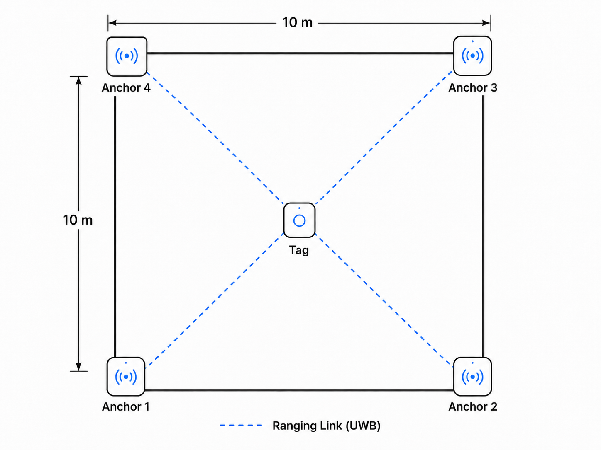
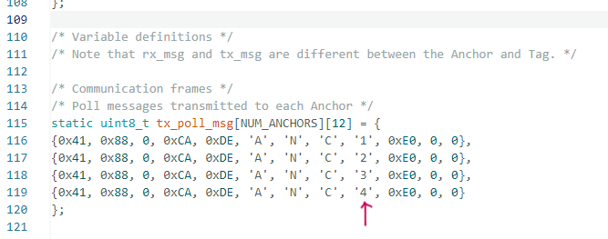
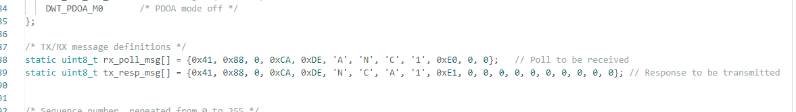

# RTLS-System
A basic Real-Time-Locationing-system

# System Configuration

This RTLS system consists of one UWB Tag and four UWB Anchors.
All Tag and Anchor nodes are implemented using ESP32 UWB DW3000 modules.

Reference: [Makerfabs ESP32 UWB DW3000](https://github.com/Makerfabs/Makerfabs-ESP32-UWB-DW3000)

The four Anchors are fixed at specific positions, and their coordinates are assigned based on measured physical distances.

When the Tag moves inside the area formed by the Anchors, the RTLS system estimates the position of the Tag using UWB ranging measurements.

Although the RTLS area can be freely defined by adjusting the Anchor positions, this system is configured in a 10 m x 10 m indoor space.

The system described below is based on the configuration shown in the figure above.

# Simple Mathematical Theory

The position of the Tag is defined as:

$$
\mathbf{x} = [x, y, z]^T
$$

The position of the i-th Anchor is defined as:

$$
\mathbf{p}_i = [x_i, y_i, z_i]^T
$$

The distance between the Tag and the i-th Anchor is defined as:

$$
r_i
$$

Then, the range equation between the Tag and each Anchor can be written as:

$$
\|\mathbf{x} - \mathbf{p}_i\|^2 = r_i^2, \quad i = 1,2,3,4
$$

Since this equation is nonlinear, the first Anchor is used as a reference to linearize the system.

By subtracting the equation of Anchor 1 from the remaining equations, the following linear system can be obtained:

$$
A\mathbf{x} = \mathbf{b}
$$

where

$$
A =
\begin{bmatrix}
2(x_2 - x_1) & 2(y_2 - y_1) & 2(z_2 - z_1) \\
2(x_3 - x_1) & 2(y_3 - y_1) & 2(z_3 - z_1) \\
2(x_4 - x_1) & 2(y_4 - y_1) & 2(z_4 - z_1)
\end{bmatrix}
$$

and

$$
\mathbf{b} =
\begin{bmatrix}
(r_1^2 - r_2^2) + (\||\mathbf{p}_2\||^2 - \||\mathbf{p}_1\||^2) \\
(r_1^2 - r_3^2) + (\||\mathbf{p}_3\||^2 - \||\mathbf{p}_1\||^2) \\
(r_1^2 - r_4^2) + (\||\mathbf{p}_4\||^2 - \||\mathbf{p}_1\||^2)
\end{bmatrix}
$$

If the matrix \(A\) is invertible, the Tag position can be calculated as:

$$
\mathbf{x} = A^{-1}\mathbf{b}
$$

# How to Use

In the Tag code, all related components are generalized based on the mathematical formulation described above.

Therefore, after constructing the actual physical environment according to the Anchor numbers and positions used in your implementation, the system can operate by setting the Anchor coordinates in the Tag code to match the real Anchor coordinates.

In the Anchor code, the communication frame must be configured according to the Anchor number.

The image above shows the communication frames used in the Tag code.
The numbers 1, 2, 3, and 4 indicate the communication frames corresponding to each Anchor.

In this image, only the `Poll` messages are shown.
However, in RTLS System, both the `Poll` and `Resp` message frames must be modified according to the Anchor number.

For example, if the Anchor number is 3, the communication frame number in the Anchor code must be changed from 1 to 3 before uploading the code to the board.

The image above shows the communication frames used in the Anchor code. The number `1` should be changed to `3` when configuring the code for Anchor 3.

